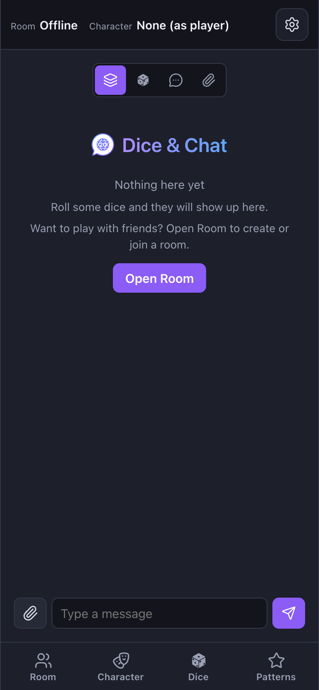
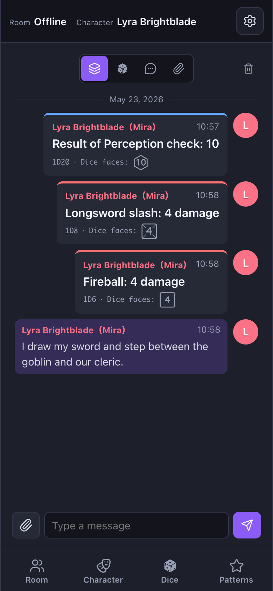

<p align="center">
  
</p>

<h1 align="center">Dice &amp; Chat</h1>

<p align="center"><strong>Кишенькова кубикова кімната для вашого вечора НРІ.</strong></p>

<p align="center">
  Відкрийте сторінку, поділіться коротким кодом кімнати — і вся партія кидає кубики разом.<br/>
  Без облікових записів, без встановлення, без ігрового сервера. Лише посилання та кубики.
</p>

<p align="center">
  <a href="https://yamadar.github.io/trpg-dice-online/"><strong>Відкрити демо →</strong></a>
</p>

<p align="center">
  <em><strong>Мови:</strong></em>
  <a href="README.md">English</a> ·
  <a href="README.ja.md">日本語</a> ·
  <a href="README.es.md">Español</a> ·
  <a href="README.pt-BR.md">Português (Brasil)</a> ·
  <a href="README.zh-CN.md">简体中文</a> ·
  <a href="README.zh-TW.md">繁體中文</a> ·
  <a href="README.de.md">Deutsch</a> ·
  <a href="README.fr.md">Français</a> ·
  <a href="README.ko.md">한국어</a> ·
  <a href="README.it.md">Italiano</a> ·
  <a href="README.ru.md">Русский</a> ·
  <a href="README.th.md">ไทย</a> ·
  <a href="README.tr.md">Türkçe</a> ·
  <a href="README.id.md">Bahasa Indonesia</a> ·
  <a href="README.pl.md">Polski</a> ·
  <a href="README.vi.md">Tiếng Việt</a> ·
  <a href="README.hi.md">हिन्दी</a> ·
  <a href="README.ar.md">العربية</a> ·
  <a href="README.uk.md">Українська</a>
</p>

<p align="center">
  
  &nbsp;
  
</p>

## Чому обрати його для наступної сесії

- **Поділіться кодом — і починайте кидати.** Майстер створює кімнату й вимовляє код із 4–6 символів; решта просто вводять його. Жодних облікових записів, жодного підтвердження поштою, жодної реєстрації.
- **Ваші кидки лишаються між вами.** Чистий P2P через WebRTC — кидки й чат ідуть напряму від пристрою до пристрою, не через жодний наш сервер.
- **Затишно на телефоні, що лежить на столі.** Мобільна верстка передусім, встановлюється як PWA на iOS і Android, відкривається на повний екран.
- **Знає 19 мов і сам перекладає чат.** Німецька жриця може жартувати з японським шахраєм, а ніхто не випадає з атмосфери.
- **Спроектований так, щоб хотілося повернутися.** Персонажі, патерни, теми, розмір шрифту та минулі сесії зберігаються локально — застосунок відчувається як *ваша* скринька з кубиками, а не чужий кіоск.

## Сесія за 30 секунд

1. **Майстер:** відкрийте демо, натисніть **Кімната → Створити** й голосно прочитайте код.
2. **Гравці:** відкрийте демо, натисніть **Кімната → Приєднатися** та введіть код.
3. **Усі:** кидайте, переписуйтесь, разом святкуйте першу натуральну 20-ку.

Майстер — це хост. Доки його вкладка відкрита, кімната жива. Закриваєте вкладку — сесію завершено. Минулі кімнати лишаються локально, тож журнал можна перечитати пізніше.

## Що в скриньці з кубиками

### Кубики, що читаються з першого погляду

`d4 · d6 · d8 · d10 · d12 · d20 · d100`, із кількістю, знаковим модифікатором і типом **шкода / перевірка**, який формулює результат так, як казали б за столом — *«Результат перевірки Сприйняття: 18»*, *«Дворучник: 11 шкоди»*. Кожне випале число відображається як невеличкий силует, що відповідає формі кубика, — читається миттєво.

### Патерни — улюблені ходи в один тап

Збережіть `2D6 + 3 — шкода` під назвою на кшталт *«Дворучник»* і повторіть кидок наступного раунду одним тапом. Патерни належать персонажам, тож два ПГ на одному пристрої мають окремі набори.

### Персонажі з портретом, нотатками та власними патернами

Кілька ПГ на одного гравця. У кожного — ім'я, спільна історія для кімнати, особиста нотатка, яку бачите лише ви, опційний портрет, власний список патернів та індивідуальне налаштування *«включати нотатку в експорт»*. Експорт у JSON для резервної копії; імпорт на іншому пристрої — і ПГ із вами на наступну сесію. Коли ви граєте персонажем, ім'я має вигляд `Персонаж (Гравець)`.

### Один стрічковий канал для кидків *і* чату

Кидки й чат живуть в одній хронологічній стрічці з фільтром **Усе / Кидки / Чат / Файли**. Автодоповнення `@` згадує саме того гравця; `@all` доходить до всіх. Додавши зображення до повідомлення, ви отримаєте автоматичне зменшення розміру перед надсиланням.

### Минулі кімнати, які можна перечитати

Кожна попередня сесія зберігається локально як довговічний журнал. Відкрийте стару кімнату з лобі лише на читання; тап по імені гравця в старому журналі покаже тодішній знімок персонажа та останній відомий портрет. Цілу кімнату (чат, кидки, зображення) можна вивантажити одним ZIP.

### Інструменти Майстра

Майстер може кидати **приховано** — інші бачать лише *«здійснено прихований кидок»*, без числа. Розділ Майстра збирає перейменування кімнати й перегенерацію коду під розкривним блоком, а кнопка виходу Майстра має назву **Закрити кімнату** — щоб було зрозуміло, що це завершує сесію для всіх.

### Інтерфейс 19 мовами &amp; авто-переклад чату

UI 19 мовами. Опційний автоматичний переклад чату використовує Chrome Translator API на пристрої, коли він доступний, і скочується до REST API [MyMemory](https://mymemory.translated.net/) без ключа. Натисніть **Оригінал** на перекладеному повідомленні, щоб побачити, що саме було надіслано.

### Маленькі деталі для зручності

Стабільний колір для кожного гравця, стриманий індикатор набору, події входу / виходу у стрічці, перемикання тем, регульований розмір шрифту та ввічливе повідомлення, коли Майстер закриває кімнату.

## Встановити на телефон (PWA)

Сайт — це Progressive Web App, тож його можна додати на головний екран iOS і Android та запускати на повний екран — без інтерфейсу браузера й з майже миттєвим повторним запуском.

- **Android (Chrome):** відкрийте демо, торкніться меню браузера, оберіть **Встановити застосунок** (або *Додати на головний екран*).
- **iOS (Safari):** відкрийте демо, натисніть «Поділитися», оберіть **На екран «Початок»**.

Service worker попередньо кешує оболонку застосунку, тож повторний запуск майже миттєвий. Самі ж кімнати — це WebRTC P2P і їм потрібне активне мережеве з'єднання.

**Орієнтація екрана:** маніфест не блокує і не перевизначає орієнтацію, тож встановлена PWA дотримується налаштування авто-обертання / блокування обертання пристрою (наприклад, на Android, якщо вимкнути авто-обертання, застосунок залишиться в поточній орієнтації, навіть якщо ви нахилите телефон).

## Як працює онлайн-обмін

Кімнати використовують **WebRTC peer-to-peer** через [PeerJS](https://peerjs.com/). Творець кімнати (Майстер) — це хост; кожен інший гравець підключається напряму до Майстра, який ретранслює спільний стан. Жодні ігрові дані не проходять через сервери, які експлуатує цей проєкт. Оскільки це P2P, кімната жива лише доки Майстер тримає вкладку відкритою.

## Стек

- [Vite](https://vite.dev/) + [React 19](https://react.dev/) + TypeScript
- [PeerJS](https://peerjs.com/) для P2P-кімнат на WebRTC
- [Vitest](https://vitest.dev/) для unit-тестів
- GitHub Pages + GitHub Actions для хостингу

## Розробка

```bash
npm install      # встановити залежності
npm run dev      # запустити dev-сервер
npm test         # виконати unit-тести
npm run lint     # лінт джерел
npm run build    # production-збірка у dist/
```

## Налаштування (опціональний TURN-релей)

WebRTC потребує TURN-релею, щоб з'єднати гравців, мережа яких блокує UDP або використовує симетричний NAT (часто в кафе/публічному Wi-Fi). Типово застосунок скочується до безкоштовних публічних TURN-серверів Open Relay Project — для випадкового використання згодиться, але без гарантій.

Для надійного релею скопіюйте `.env.example` у `.env` і заповніть:

- `VITE_TURN_URLS` — TURN-адреси через кому. Додайте запис `turns:` на TCP/443, щоб працювало там, де UDP заблоковано.
- `VITE_TURN_USERNAME` — ім'я користувача TURN.
- `VITE_TURN_CREDENTIAL` — облікові дані / пароль TURN.

> **Безпека:** Vite вставляє кожну змінну `VITE_*` у production-бандл, тож TURN-обліковки, задані тут, видно всім, хто відкриє сторінку. Використовуйте короткоживучі / тимчасові TURN-обліковки (наприклад, патерн time-limited credential з TURN REST API) та налаштуйте обмеження з боку провайдера — дозволені origin'и, IP-фільтри, місячні квоти. Не повторно використовуйте тут довготривалі production-обліковки.

Щоб задіяти їх у деплої на GitHub Pages, додайте як секрети репозиторію і прокиньте на кроці збірки в `.github/workflows/deploy.yml`. Безкоштовні варіанти: безкоштовний план [Metered](https://www.metered.ca/) або self-host [coturn](https://github.com/coturn/coturn).

## Деплой

Push до `main` запускає workflow GitHub Actions (`.github/workflows/deploy.yml`), що виконує lint, тести, збірку та публікує на GitHub Pages. Production base path — `/trpg-dice-online/`; перезапишіть змінною середовища `BASE_PATH` для іншого хостингу.

## Документація

- Вимоги та план реалізації: [`docs/REQUIREMENTS.md`](docs/REQUIREMENTS.md)
- Журнал змін: [`docs/CHANGELOG.md`](docs/CHANGELOG.md)
- Дослідження API перекладу в реальному часі: [`docs/TRANSLATION_API_RESEARCH.md`](docs/TRANSLATION_API_RESEARCH.md)

## Ліцензія

[MIT](LICENSE) © 2026 yamadar
